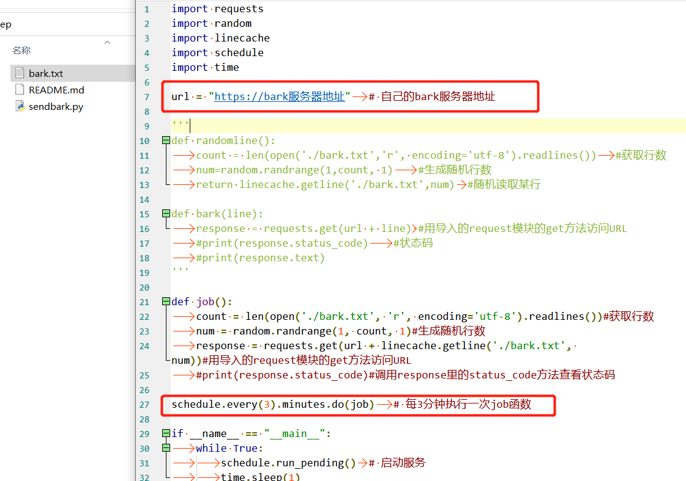

# 意志力保持工具（不适用于所有人）

## 原理说明
部分处于学习中的人群可能只能保持短时间的学习热情，而心灵鸡汤等激励性语句能使他们产生学习的动力。
因此若在学习热情消散之前及时摄入激励性语句，就有几率继续维持学习的热情。
本工具通过每3分钟向目标手机发送激励性语句，以实现意志力保持的效果。

## 必备
IOS系统手机
bark软件

## 使用
配置bark服务器地址
也可修改定时发送的时间，默认为3分钟

运行
、、、
python sendbark.py
、、、

## 效果

参考bark软件配置

## 其他
bark.txt 为激励性语句的文件，每一行为一句激励性语句
数据来源于网络收集，因数据量较大故语句可能存在问题，仅供参考